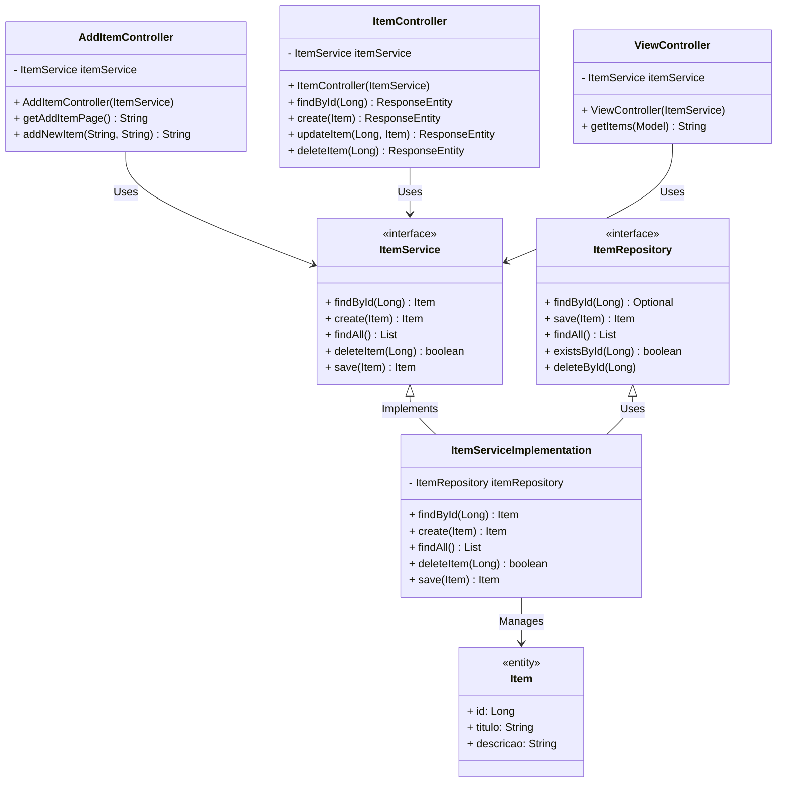

# Todo List API

Este projeto foi desenvolvido como parte de um desafio de bootcamp de Spring Boot da Claro. A aplicação é uma API RESTful que permite gerenciar uma lista de itens, com funcionalidades básicas de CRUD (Create, Read, Update, Delete). A view foi implementada como um diferencial criativo, mas o foco principal é a API.

## Funcionalidades

- **Create**: Adicionar novos itens à lista.
- **Read**: Listar todos os itens e visualizar detalhes de um item específico.
- **Update**: Atualizar os detalhes de um item existente.
- **Delete**: Remover itens da lista.

## Tecnologias Utilizadas

- **Spring Boot**: Framework principal para desenvolvimento da API.
- **Thymeleaf**: Motor de templates utilizado para a view.
- **PostgreSQL**: Banco de dados utilizado para armazenamento persistente.
- **Maven**: Gerenciador de dependências e build tool.

## Diagrama de Classes



## Como Rodar o Projeto

### Pré-requisitos

- Java 17
- Maven
- H2 (ou outro banco de dados relacional)

### Configuração

1. Clone o repositório:

   ```bash
   git clone https://github.com/moiz4rt/todo-list-spring-boot-claro.git
   ```

2. Navegue até o diretório do projeto:

   ```bash
   cd todo-list-spring-boot-claro
   ```

3. Execute o projeto:

   ```bash
   mvn spring-boot:run
   ```

### Endpoints da API

- **GET /items**: Retorna a lista de todos os itens.
- **POST /items**: Adiciona um novo item. Requer um corpo JSON com `titulo` e `descricao`.
- **GET /items/{id}**: Retorna detalhes de um item específico.
- **PUT /items/{id}**: Atualiza um item existente. Requer um corpo JSON com `titulo` e `descricao`.
- **DELETE /items/{id}**: Remove um item da lista.
